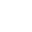

### Hello 👋, my name is Nicholas! 

<!-- Top lines -->

 

- I am a Computer Science Honours Graduate
- I love to program, game and most importantly make games!
- I also like to write and hope to complete stories soon.
- My coding journey began even before I entered highschool.
- I'm always ready to learn and experiment.

**Personal Details**

- 👨‍🏛 I am a graduate of **Carleton University**.
- 💻 My Major is **Computer Science**.
- 🌱 I'm currently learning **Unreal Engine and Godot Engine**. 
- 🤔 My hobbies are **coding, writing, gaming**.
- 💼 I am currently looking for employment.
- 💬 If you have any questions, **feel free to ask me**.

<!-- Middle Lines -->

 

**💻 Languages Used**

**🛠️ Platforms Used**

<!-- Middle Lines -->

 

### Current Projects

<blockquote>
<dl>
    <dt><i><b>Mod-iffy</b></i></dt>
    <dd>GameDev. First Person Roguelike. </dd>
    <dt><i><b>Obscura</b></i></dt>
    <dd>GameDev. First Person Story. </dd>
    <dt><i>Untitled Project</i></dt>
    <dd>GameDev. Testing Mechanics. </dd>
</dl>
</blockquote>

### Past Projects

<blockquote>
<dl>
    <dt>Wilderness Surival Game</dt>
    <dd>"In the Thick of it" - [COMP 4900 Group Project] </dd>
    <dd><i>Private</i> - <a href="https://jacksonsilver.itch.io/in-the-thick-of-it">Web Version Available</a></dd>
    <dt>Phishing Identification Game</dt>
    <dd>"Lost In The Email" - [COMP 4900 Group Project] </dd>
    <dd><i>Private</i> - <a href="https://jacksonsilver.itch.io/lost-in-the-email">Web Version Available</a></dd>
    <dt>Real Time Strategy</dt>
    <dd>"Antopia" - [COMP 4501 Group Project] </dd>
    <dd><i>Private</i> - Not Available</dd>
    <dt>Competitive multi-agent environment</dt>
    <dd>"Farmer Vs. Zombie" - [COMP 4010 Group Project] </dd>
    <dd><i>Private</i> - Not Available</dd>
    <dt><i><b>Survival, stealthy 'horror'</b></i></dt>
    <dd>"The Hungry Man" - [COMP 3501 Group Project] </dd>
    <dd><i>Public</i> - <a href="https://github.com/gabrielmartell/COMP3501-Project">Repo. Available</a></dd>
    <dt><i><b>SQL Database</b></i></dt>
    <dd>"SteamDB Console System" - [COMP 3005 Project] </dd>
    <dd><i>Private</i> - Not Available</dd>
    <dt><i><b>Heart Rate Variability Device</b></i></dt>
    <dd>"HeartWave" - [COMP 3004 Group Project] </dd>
    <dd><i>Private</i> - Not Available</dd>
    <dt><i><b>Language Compiler</b></i></dt>
    <dd>"SmallTalk Compiler" - [COMP 3002 Project] </dd>
    <dd><i>Private</i> - Not Available</dd>
    <dt><i><b>A motorbike 'Shmup'</b></i></dt>
    <dd>"The Way of Blood" - [COMP 2501 Group Project] </dd>
    <dd><i>Public</i> - <a href="https://github.com/gabrielmartell/The-Way-Of-Blood">Repo. Available</a></dd>
    <dt><i><b>Community Fridge Website</b></i></dt>
    <dd>Final Assignment - [COMP 2406 Project]     </dd>
    <dd><i>Private</i> - Not Available</dd> 
</dl>
</blockquote>

<!-- Middle Lines -->

 
 

    
    
    

 

<!-- Middle Lines -->

 

**Currently Learning**

-  : I am hoping to learn this game engine along side what I have already learned through my game development study.
-  : Although I have had experience working in Godot, I will only consider myself completely experienced once I fully release a game made in the engine.

 

<!-- Bottom lines -->
